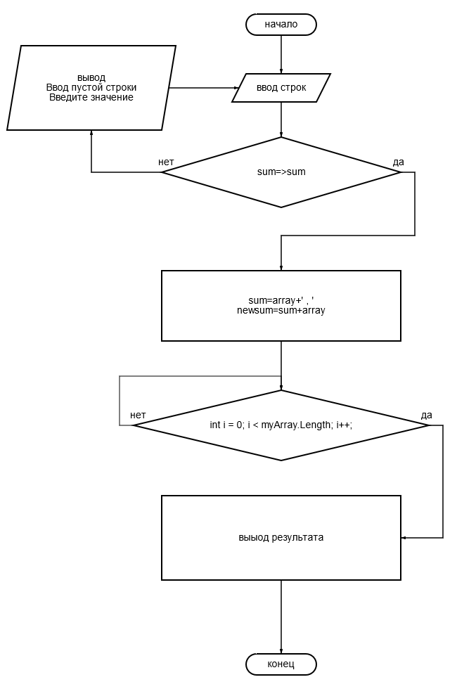

## Итоговая контрольная работа по основному блоку.

В этой работе, рассматривается проект создания программы которая из имеющегося массива строк формирует новый массив из строк, длянна которых меньше либо равна трем символам.Первончальный массив вводится с клавиатуры.

## Блок схема, данного задания выглядит следующим образом. 

## Решение поставленной задачи.

Решение задачи находится [здесь](Program.cs)
## В подведении итогов.

данная программа принимает на входе введенные с клавиатуры буквенно-цифровые значения, через запятую, формирует из них массив значений, и отсеивает только те в которых количество символов равно трем.
Затем, отсеянный массив выводится на экран в виде строки."# -GeekBrains" 
